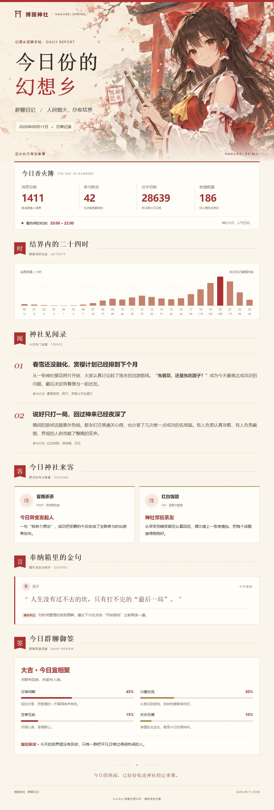

# 博丽灵梦 · 神社日记

适用于 `SXP-Simon/astrbot_plugin_qq_group_daily_analysis` 的独立报告主题。

红白巫女、和纸底色、朱印、御币与神社梅花。包含消息统计、24 小时活跃图、热门话题、群友画像、金句与群聊质量分析。长图宽度 1080 像素，网页支持手机排版；关闭或没有内容的分析栏目自动隐藏。



## 安装

1. 在 AstrBot 中打开「群分析总结插件」的 WebUI。
2. 进入配置页的「安装模板」，粘贴仓库链接 `https://github.com/koichinoi/gda_hakurei_reimu` 安装；也可在 GitHub 点击「Code → Download ZIP」下载后上传 ZIP。
3. 如果需要手动填写模板名，填写 `gda_hakurei_reimu`。
4. 在报告模板选项中选择「博丽灵梦 · 神社日记」。也可以在历史报告中切换主题重绘。

按照当前插件文档，自定义模板安装后无需重启。`/查看模板` 与 WebUI 画廊可以显示包内的 `preview.jpg`。

如果你的版本没有 ZIP 上传入口，将整个 `gda_hakurei_reimu` 文件夹放到 AstrBot 根目录下的：

```text
data/plugin_data/astrbot_plugin_qq_group_daily_analysis/custom_t2i_templates/reporting_templates/
```

最终应能在 `reporting_templates/gda_hakurei_reimu/image_template.html` 找到主模板。较老版本若不支持自定义目录，请先更新插件。

## 文件说明

- `image_template.html`：长图入口，明确指定 1080 像素视口。
- `html_template.html`：响应式网页入口。
- `report_body.html`：共同的报告布局。
- `shared_styles.html`：色彩、字体与排版；顶部 `:root` 可调整主题色。
- `inline_assets.html`：内嵌的灵梦插画，随报告传输，无需配置图床。
- 五个内容组件：话题、群友画像、金句、活跃图、群聊质量。
- `template.json`：主题显示名称与标签。
- `preview.jpg`：主题画廊预览，使用虚构示例数据。

这里的 `*.html` 是插件读取的 Jinja2 源模板。直接用浏览器打开源码不会填充数据；成品效果请查看上方预览图。

## 资源与兼容性

- 灵梦主题插画通过内置 ImageGen 工具生成，压缩为 JPEG 并内嵌；最终生成提示词见 `ARTWORK_PROMPT.txt`。角色来自《东方Project》，这是非官方主题。
- 使用系统中文字体，不主动下载网络字体。渲染服务需具备中文字体，推荐 Noto Sans CJK SC / Noto Serif CJK SC；不同系统的字形可能略有差异。
- 主题插画及装饰不依赖外部网络。群友头像与可选人格图片由插件提供，是否需要联网取决于插件传入的资源。
- 画像标签支持插件提供的 `profile_display`，缺失时回退 MBTI；隐藏昵称模式遵循插件提供的脱敏数据。
- 此主题仅改变视觉排版，不改变分析提示词、人格或分析结果。主题栏名不表示 AI 已在扮演灵梦。
- 对照插件 v5.5.0、提交 `45f7000c90421c66ee92e0945e5d81286756f2d4` 制作。已验证 Jinja2 沙箱渲染、ZIP 安装与主题加载，以及桌面/手机布局、空栏目、零活跃、长文本和字段转义。未在用户实际 AstrBot 实例或远程 T2I 服务中运行。

上游开发说明：https://github.com/SXP-Simon/astrbot_plugin_qq_group_daily_analysis/blob/main/docs/REPORT_TEMPLATE_GUIDE.md
