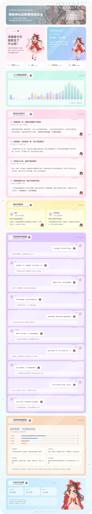

# 博丽灵梦 · 群聊手帖

为 AstrBot「群聊日常分析」插件制作的独立主题，按浅色卡片参考排版设计。

## 安装

在插件 WebUI 的「安装模板」中填写以下 GitHub 链接：

https://github.com/koichinoi/gda_hakurei_reimu/tree/pastel

**模板名请填写 `gda_reimu_pastel`**，安装后选择「博丽灵梦 · 群聊手帖」。此分支是浅色卡片与多动作版本，仓库的 `main` 分支是神社日记版本。

也可以从此分支下载源码 ZIP，或上传已经打包好的 `gda_reimu_pastel.zip`；上传源码 ZIP 时同样手动填写模板名 `gda_reimu_pastel`。手动安装则把本目录放入插件数据目录 `custom_t2i_templates/reporting_templates/gda_reimu_pastel/`。

包含长图、响应式网页和全部五个子模块。话题、称号、金句、活跃轨迹、群聊质量均取插件实际数据；没有数据的模块自动隐藏。底部「总灵力消耗 / 注入灵力 / 释出灵力」分别使用 `total_tokens / prompt_tokens / completion_tokens`，零值保留，缺失显示「未提供」。

角色插画为 AI 生成的博丽灵梦同人图，不是官方素材。图片全部内嵌，渲染不需要访问外部图库。预览中的聊天内容和统计均为示例数据。

## 角色变化

开头为张开双臂的红白巫女服灵梦；活跃时段为手持御币的站姿；底部为红白日常装喝茶的灵梦。微笑、眨眼比耶、思考和合掌祝福四种贴纸在卡片中依次轮换，分区标题也使用不同表情。
